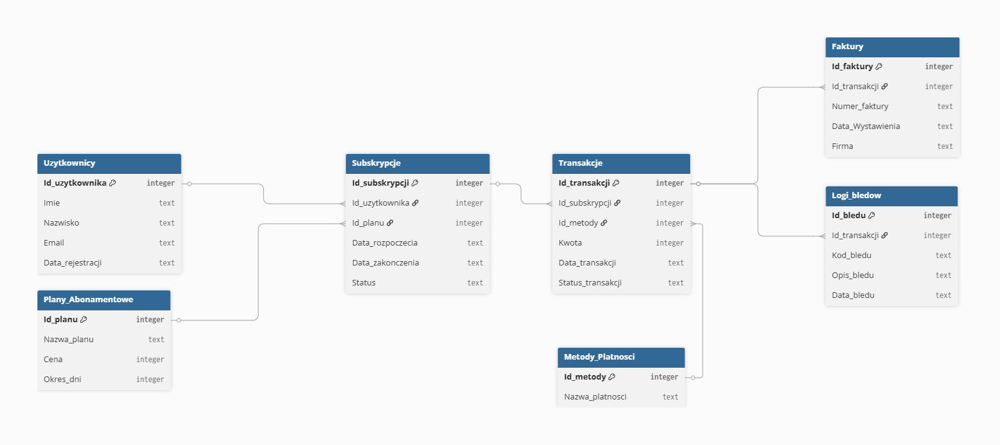
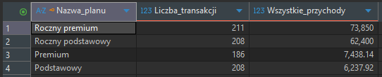
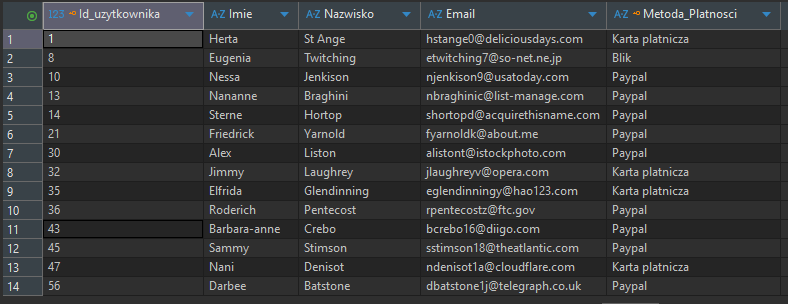
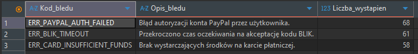

# System_subskrypcji_sql
Projekt bazy danych SQLite dla systemu zarządzania subskrypcjami użytkowników. Zawiera kompletną strukturę tabel, dane testowe, analityczne zapytania SQL oraz diagram ERD.



<br><br>

## Struktura Bazy Danych
Baza składa się z następujących tabel:
- Użytkownicy: dane profilowe klientów oraz data rejestracji.
- Plany Abonamentowe: konfiguracja pakietów (rodzaj planu, cena, okres ważności w dniach).
- Subskrypcje: relacja łącząca użytkownika z planem, data rozpoczęcia/zakończenia oraz status.
- Metody Płatności: słownik dostępnych form płatności (karta, BLIK, paypal).
- Transakcje: historia wpłat powiązana z fakturowaniem i statusem płatności.
- Faktury: dokumenty sprzedażowe powiązane z transakcjami, zawierające numery faktur, daty wystawienia oraz dane wystawcy.
- Logi błędów: rejestr nieudanych operacji transakcyjnych do celów analitycznych.

<br><br>

## Jak uruchomić projekt lokalnie?
1. Pobierz plik bazy danych **System_subskrypcji.sqlite** z tego repozytorium.
2. Otwórz plik bazy za pomocą dowolnego menedżera baz SQLite lub skorzystaj z darmowej przeglądarki **online** np. [SQLite Viewer Beta](https://beta.sqliteviewer.app/).
3. Utwórz nowe połączenie typu SQLite i wskaż pobrany plik bazy danych.
4. Wszystkie tabele, relacje oraz wprowadzone dane testowe będą od razu widoczne i gotowe do analizy.

<br><br>

### Przykłady gotowych zapytań SQL, które pozwalają na szybką analizę danych zgromadzonych w bazie:
*1. RAPORT PRZYCHODÓW WEDŁUG PLANÓW ABONAMENTOWYCH*

*Pozwala sprawdzić, który plan przynosi firmie największe zyski.*
```sql
SELECT pa.Nazwa_planu,
COUNT(t.Id_transakcji) AS Liczba_transakcji,
SUM(t.Kwota) AS Wszystkie_przychody
FROM Plany_Abonamentowe pa
JOIN Subskrypcje s ON pa.Id_planu = s.Id_planu
JOIN Transakcje t ON s.Id_subskrypcji = t.Id_subskrypcji
WHERE t.Status_transakcji = 'Opłacona'
GROUP BY pa.Nazwa_planu
ORDER BY Wszystkie_przychody DESC;
```


<br><br>

*2. LISTA AKTYWNYCH KLIENTÓW I ICH METOD PŁATNOŚCI*

*Wyciąga dane kontaktowe osób, które mają obecnie opłacony dostęp.*
```sql
SELECT u.Id_uzytkownika, u.Imie, u.Nazwisko, u.Email, mp.Nazwa_platnosci AS Metoda_Platnosci
FROM Uzytkownicy u 
JOIN Subskrypcje s ON u.Id_uzytkownika = s.Id_uzytkownika
JOIN Transakcje t ON s.Id_subskrypcji = t.Id_subskrypcji
JOIN Metody_Platnosci mp ON t.Id_metody = mp.Id_metody 
WHERE s.Status = 'Aktywna'
GROUP BY u.Id_uzytkownika 
```


> Pełna lista zawiera więcej rekordów – powyższa grafika prezentuje jedynie początkowy fragment wyniku zapytania.

<br><br>

*3. ANALIZA NAJCZĘSTSZYCH BŁĘDÓW SYSTEMU PŁATNOŚCI*

*Pomaga działowi technicznemu sprawdzić, jakie problemy występują przy transakcjach.*
```sql
SELECT lb.Kod_bledu, lb.Opis_bledu, 
COUNT(*) AS Liczba_wystapien
FROM Logi_bledow lb
GROUP BY lb.Kod_bledu, lb.Opis_bledu
ORDER BY Liczba_wystapien DESC;
```


